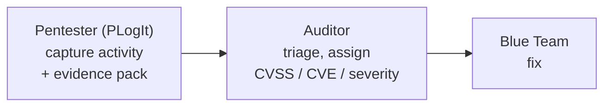
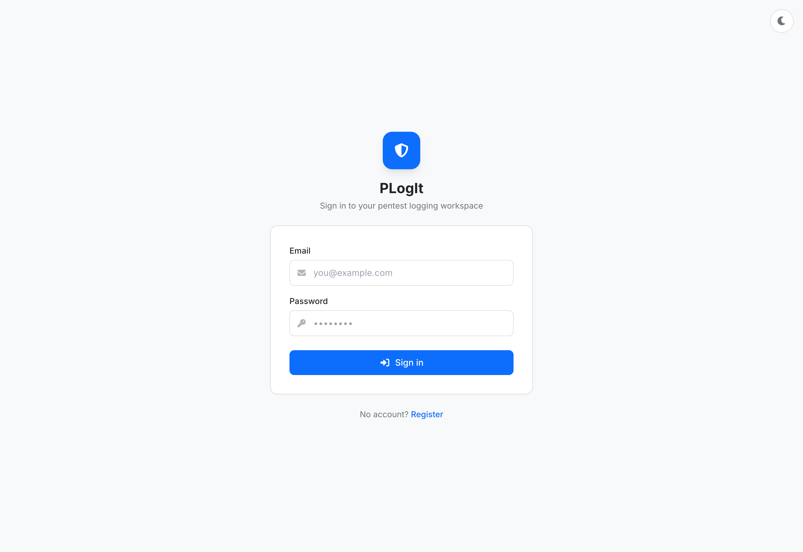
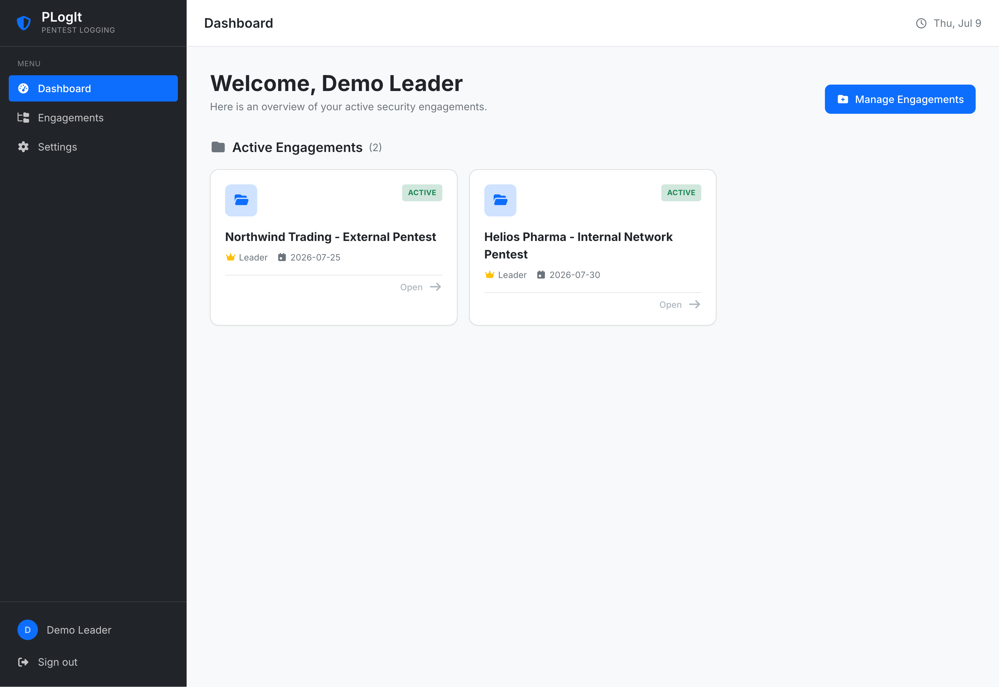
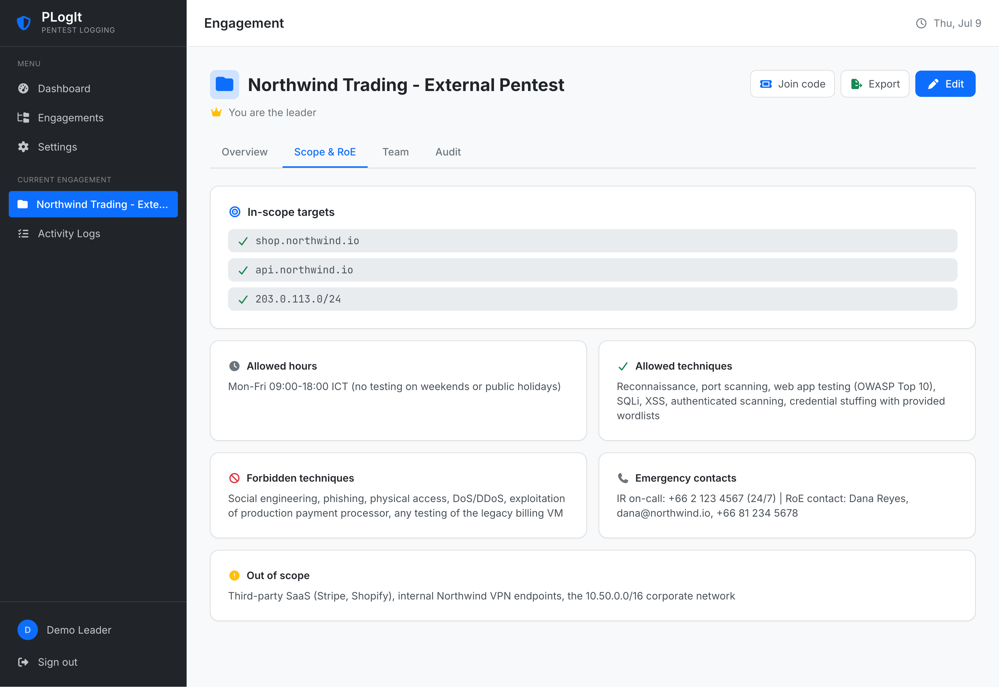
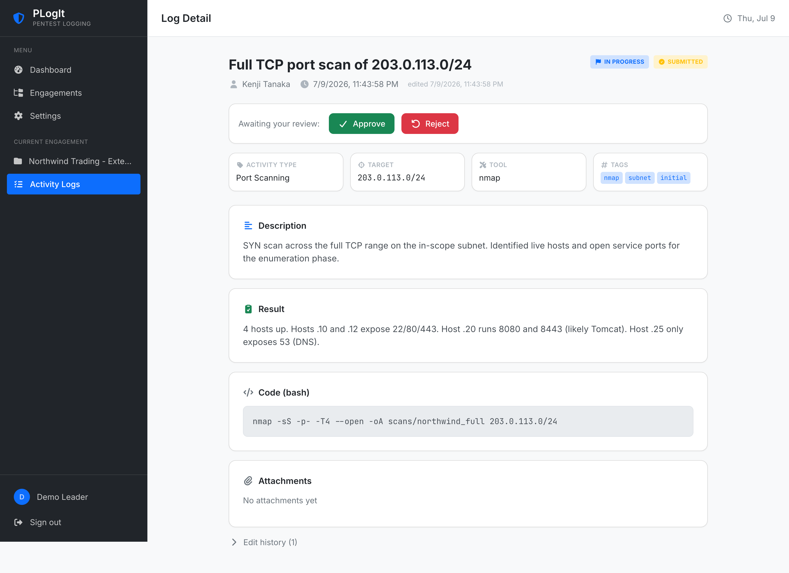
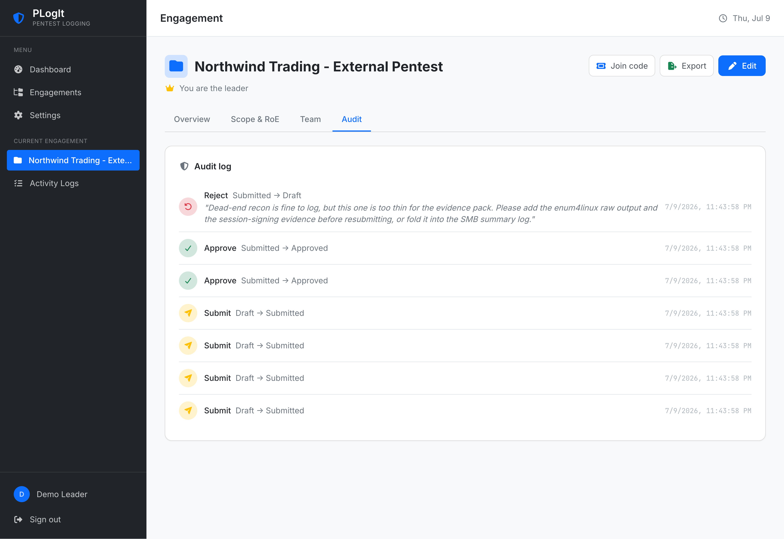
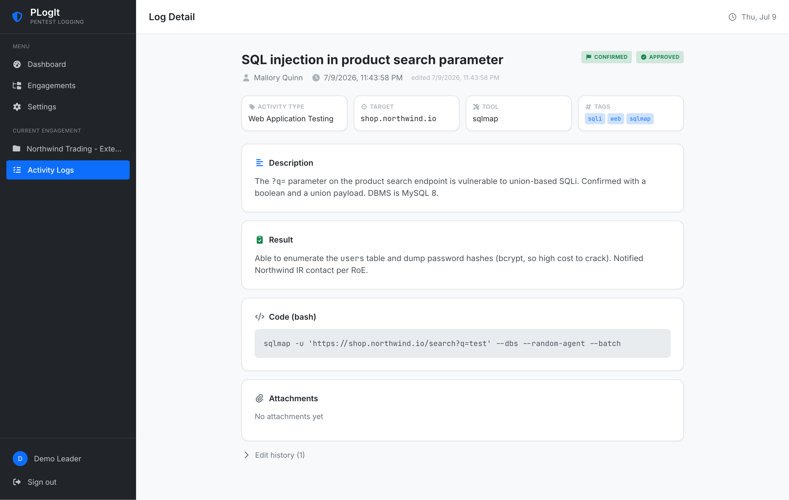
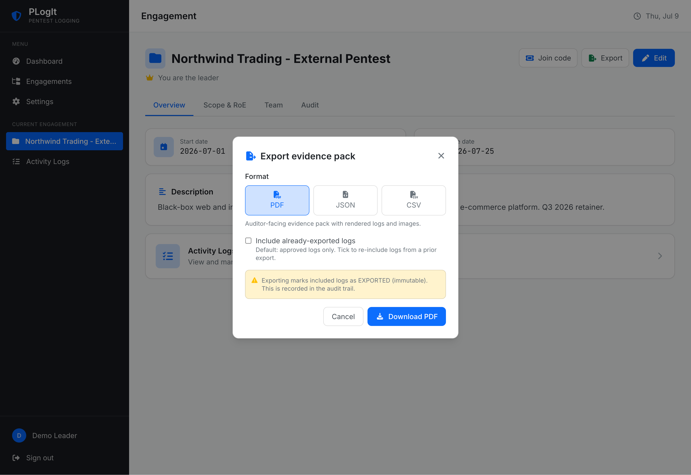
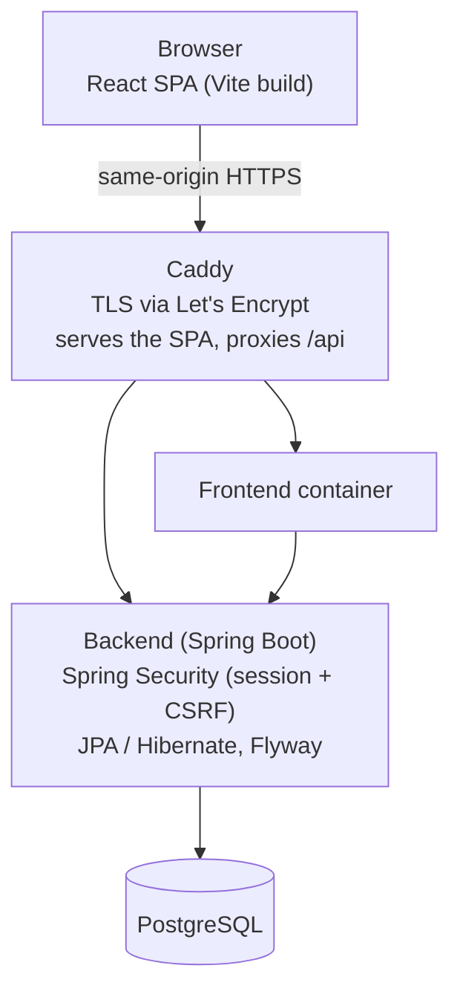

# PLogIt

A web application for pentesters to log engagement activity in a structured, reviewable, auditable way. It captures *what was done* and *what was found*, with evidence, and hands a clean evidence pack to a downstream auditor who decides what matters.

PLogIt sits at the front of a remediation pipeline:



The pentester stage is PLogIt's job. Severity rating, CVSS, CVE mapping, and client-facing reporting belong to the downstream auditor, not to us. The principle is capture everything, judge nothing: a log is raw activity, and judgment is someone else's job.

Most teams track pentest activity in a notebook or a shared document. PLogIt replaces that with a multi-user system that keeps an audit trail, enforces who is allowed to approve what, versions every edit, and exports an evidence pack a downstream tool can ingest directly instead of retyping. It was built as a university capstone for a systems software construction course.

<p align="center">
  
</p>

## What it does

PLogIt has two roles, and what you can do depends on yours. Both are per-engagement, so a user's role in one engagement says nothing about their role in another.

Every signed-in user lands on a dashboard of their engagements, each shown as a card with its role badge, status, and due date. From there they open an engagement or join a new one with a short code. The model is Google Classroom: anyone creates an engagement and becomes its leader, members join via a code, and a pentester can be in many engagements across different leaders.

<p align="center">
  
</p>

A member creates activity logs and edits their own while they are still drafts. Each log carries an activity type, a target, the tool used, an outcome, free-form tags, a markdown description and result, an optional code block, and image evidence. Once a log is submitted, the member can no longer edit it. A leader reviews submitted logs from a dedicated queue, approves or rejects them, and a rejection has to carry a comment.

A leader does everything a member does, plus manages the engagement: edits the scope and rules of engagement, generates or regenerates the join code, adds or removes members, transfers leadership, reviews and approves logs, and exports the evidence pack. The rule that matters most is separation of duties: only the leader can approve a submitted log, and that check lives on the server, not in the interface.

<p align="center">
  
</p>

## The review workflow

A log moves through four states, and the legal moves are defined by a state machine rather than scattered checks. Each state is a class that declares which transitions it allows and who may do them, and a flyweight registry maps the persisted enum to the behavior object. An illegal transition returns 409 and a wrong-role attempt returns 403.

<p align="center">
  
</p>

| From | Action | To | Who | Guard |
|---|---|---|---|---|
| Draft | Submit | Submitted | Author or leader | |
| Submitted | Approve | Approved | Leader only | |
| Submitted | Reject | Draft | Leader only | comment required |
| Approved | Export | Exported | Leader only | |
| Exported | Re-export | Exported (unchanged) | Leader only | creates a new audit event |

Only the leader can approve or export, and that check is enforced in the backend. Removing a button from the UI is never what stops an unauthorized action. Re-exporting an already-exported log does not change it, but it does create a new audit event, so the record shows that the pack was regenerated.

## Version history and audit trail

Every log edit snapshots a full copy of the editable fields, not a diff, so the history shows exactly what each version looked like rather than asking the reader to reconstruct it. Any member can see the edit history of a log in the engagement; only the leader sees the system audit trail.

The audit trail is driven by a Spring application event, not by the review service writing to it directly. When a transition happens, the service publishes a `LogTransitionedEvent`, and a `@TransactionalEventListener` running in the same transaction writes the `AuditLog` row. That means the audit write joins the transition's transaction: if the transition rolls back, the audit entry does too, so there are no orphan records describing things that never happened. This is the Observer pattern doing real work, keeping the auditing concern out of the review code.

<p align="center">
  
</p>

## Markdown and attachments

Descriptions and results are written in markdown and rendered to sanitized HTML on read. The backend parses with flexmark-java and strips anything dangerous with the OWASP Java HTML Sanitizer, so the HTML the browser receives has already been cleaned. The stored data stays as the user's raw markdown, which preserves their intent for editing and means every read produces a freshly sanitized result.

Image attachments are validated by their actual bytes, not their filename extension. Apache Tika reads the magic bytes at the start of the file, and only PNG, JPEG, GIF, and WebP are accepted. A file named `exploit.png` that is actually a script is rejected. Files are stored outside the web root, organized by engagement and log.

<p align="center">
  
</p>

## Export

A leader exports an engagement in three formats, and each comes from a strategy selected by a factory keyed on format. Adding a format is a new class and no caller changes.

The PDF is an auditor-facing evidence pack, not a client deliverable. It carries a cover page, the scope and rules of engagement, the chronological logs with their rendered markdown, code blocks, and inlined evidence images, and an appendix with the export counts. The JSON and CSV exports are machine-readable, carrying the raw markdown so a downstream tool can ingest directly. The OpenHTMLtoPDF library renders the HTML template, and it reuses the same sanitized markdown the app produces, so there is one sanitization path feeding both the UI and the PDF.

Export is a state-changing action: every approved log included in the pack is marked as exported and becomes immutable, and each one fires an audit event. That is why the endpoint is a POST rather than a GET.

<p align="center">
  
</p>

## Architecture

PLogIt is two separate applications. The frontend is a React single-page app built by Vite. The backend is a standalone Spring Boot REST API. They talk over HTTP and JSON and are never merged into one process.

The Vite dev proxy serves the API under the same origin as the SPA, and production uses Caddy to do the same thing, so the browser never deals with CORS and the session cookie stays first-party.



Inside the backend, a request flows through a controller that speaks DTOs, into a service that holds the domain logic, down to a Spring Data JPA repository and PostgreSQL. A mapper layer keeps the JSON wire format separate from the JPA entities.

## Design patterns

A handful of patterns carry real weight in the code rather than sitting in comments. The review workflow is a State machine, where each state class owns its own transitions and role checks, and a flyweight registry reconciles the persisted enum with the behavior objects. Export uses a Factory keyed on format together with a Strategy per format. Audit logging is an Observer: the service publishes an event and a listener records it, which keeps auditing out of the workflow code. Data access goes through Spring Data JPA repositories, and a DTO and mapper layer keeps the API contract independent of the persistence model. Composable log filters are built with the Specification pattern, chaining predicates with `.and()`. These line up with SOLID in practice: thin controllers, translation isolated in mappers, and behavior that extends by adding a class rather than editing an existing one.

## Tech stack

| Area | Technology |
|---|---|
| Backend | Spring Boot 3.5.16, Java 21, Maven |
| Persistence | Spring Data JPA / Hibernate, PostgreSQL, Flyway |
| Security | Spring Security, session cookies (httpOnly, Secure, SameSite), CSRF token, BCrypt |
| Markdown and uploads | flexmark-java, OWASP Java HTML Sanitizer, Apache Tika (magic-byte detection) |
| Reporting | OpenHTMLtoPDF 1.1.40 (PDF), Jackson (JSON), hand-rolled RFC 4180 CSV |
| Frontend | React 18, Vite 6, TypeScript, Tailwind CSS 3.4 |
| Containers | Docker multi-stage builds, non-root images |
| Proxy and TLS | Caddy with automatic TLS via Let's Encrypt |
| CI/CD | GitHub Actions with Semgrep (SAST) and Trivy (CVE, secret, misconfiguration scanning), both blocking |

A few of these were deliberate. The frontend is a Vite SPA rather than Next.js, on purpose, so no frontend framework can quietly become a second backend; the backend is Spring Boot and only Spring Boot. Authentication uses stateful session cookies with CSRF protection rather than JWTs, which suits an app served from a single origin and avoids the storage and expiry concerns tokens introduce. The UI is written from scratch against a token-based design system rather than pulled from a component kit, so the look is purpose-built for a security tool rather than a generic framework skin.

## Security

Security is the point of the project, so it runs through the whole thing. Authentication uses Spring Security with session cookies and BCrypt password hashing. Authorization is enforced on the server: every engagement-scoped endpoint checks membership, non-members get a 404 rather than a 403 so engagement existence cannot be enumerated, and leader-only actions use a dedicated assertion. The security filter chain requires authentication for everything except health, login, and registration.

CSRF protection uses a cookie-based token that the SPA reads and echoes back in a header on unsafe requests. Markdown is sanitized on read with a strict allowlist, so script tags, javascript URLs, and event handlers are stripped before the HTML reaches the browser. Image uploads are validated by magic bytes, not extension. The CI scanners are treated as gates: when Semgrep or Trivy flags something, it gets fixed rather than suppressed. During development Trivy flagged a CVE in the OWASP HTML Sanitizer itself, the very library added for protection, and it was patched by a version bump.

## Running it locally

Docker and Docker Compose are the only things you need installed. Java and Node both run inside the build.

```bash
# 1. Configure the environment
cp .env.example .env
# edit .env: set POSTGRES_PASSWORD and APP_SESSION_SECRET

# 2. Start Postgres, the backend, and the frontend
docker compose --profile app up --build
```

The frontend is served at http://localhost:5173, the API at http://localhost:8080, and Postgres listens on 5432. A seed user is created in the dev profile for immediate login. `.env.example` documents every configuration key.

To run the backend and frontend directly during development, start Postgres with `docker compose up -d db`, then run the backend with `mvn spring-boot:run` and the frontend with `npm install && npm run dev` in the `frontend/` directory.

## Continuous integration

Every push runs a GitHub Actions pipeline. The backend job builds and runs the full test suite with Testcontainers against a real PostgreSQL on Java 21. The frontend job installs dependencies, lints with ESLint, type-checks and builds with Vite. Two security scanners run and can fail the build: Semgrep with the default, OWASP Top Ten, and secrets rulesets, and Trivy across dependencies, secrets, and misconfiguration at high and critical severity. All GitHub Actions are pinned to full commit SHAs, not mutable tags, after Semgrep flagged mutable-tag supply-chain risk in the pipeline itself.

## Testing

The backend has 77 integration test methods running against a real PostgreSQL in CI via Testcontainers. They cover authentication, engagement authorization and isolation, log CRUD and its edit constraints, the full review state machine including role gating and the export transition, markdown sanitization, attachment upload and download authorization, version history, and the audit trail. A separate HTTP-level test script exercises the real wire contract including the CSRF cookie flow, and it caught a Spring Security 6 deferred-token bug that the MockMvc suite could not, because MockMvc synthesizes CSRF tokens and bypasses the real cookie flow.

## Project layout

| Path | What lives there |
|---|---|
| `backend/` | Spring Boot 3.5.16, Java 21, Maven |
| `backend/src/main/java/io/muzoo/ssc/plogit/` | `config/`, `domain/`, `domain/review/`, `repository/`, `security/`, `service/`, `service/export/`, `web/`, `web/dto/`, `web/exception/` |
| `backend/src/main/resources/` | `application.yml`, Flyway `db/migration/` |
| `backend/src/test/java/` | Integration tests (Testcontainers, real PostgreSQL) |
| `frontend/` | React 18 + Vite 6 + TypeScript |
| `frontend/src/` | `components/`, `hooks/`, `lib/`, `pages/` |
| `.github/workflows/ci.yml` | CI pipeline (Semgrep + Trivy, blocking) |
| `docker-compose.yml` / `docker-compose.prod.yml` | Dev and prod Compose stacks |
| `Caddyfile` | Reverse proxy with automatic TLS |
| `.env.example` | Documented configuration keys |

The codebase has 9 JPA entities, 9 repositories, 24 REST endpoints, and about 9 React pages across the engagement and log workflows.

## About this project

PLogIt was built as a university capstone for a systems software construction course. The package name (`io.muzoo.ssc.plogit`) reflects the course convention.
